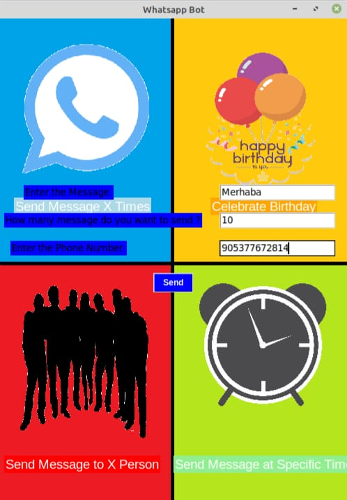
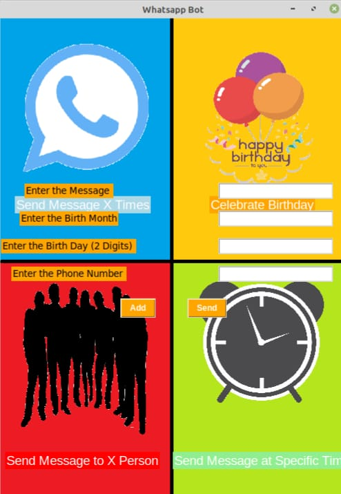
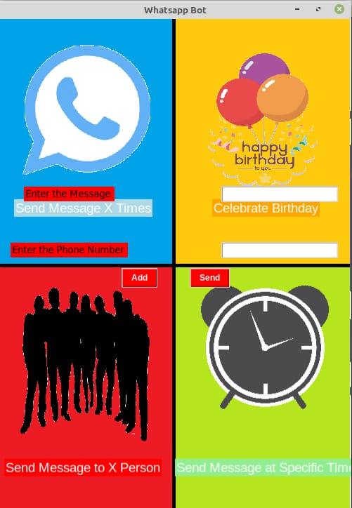

# WhatsappBOT
Send messages to any person in any time.

This is the Main Page of the application.First Option provides send as many messages as you want to a person.

This is the input part.You enter Phone Number with country code,Message and Number of Messages.I don't try the maximum message capacity but you can try.

Result of the First Option.I tried send "Merhaba" ten times.

This is the Second Option.This provides send message in specific month and day.You can add all of your relationships in the input part.Input part saves input in the "birthday.json" and you run the program it's  control the dates and if it matches,bot send it.

Third Option : If you want send one message many person,you should choice this option.Example : In important days like holidays and feasts.You need to enter message and phone number here.

Fourth Option : This option provides if you busy with your job and forget send important message to anyone.Just use it set hour and seconds just like "12:00".

It is my first application with GUI.
